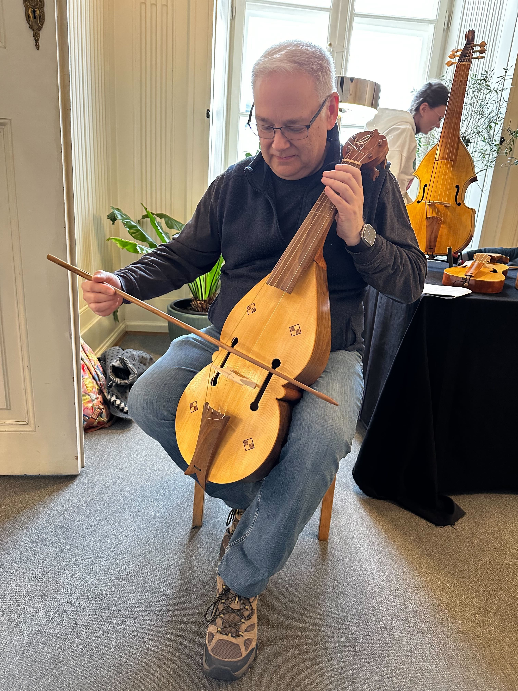

Thanks to suggestion from a friend, I was able to try out a few old-style stringed instruments at String Days in Krakow, Pl.

Special thanks to Matthew Farley at [Early Music Instruments](https://www.earlymusicinstruments.com) for the use of this "fiddle".

And btw, I know it looks like I am holding the bow wrong, but apparently this was the proper grip back in the day.

