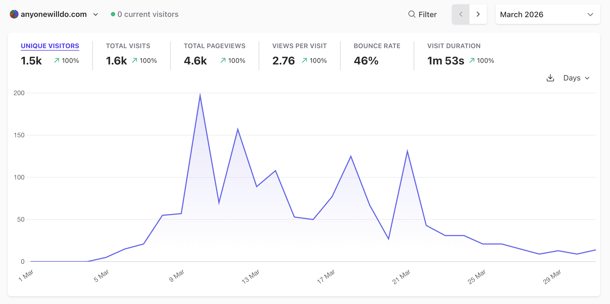

Here is our 30-day web analytics check-in as software engineers just winging the promotion part.

30 days ago we launched anyonewilldo.com — my version of a wheel of names tool, built with the features I actually wanted: no ads, random group formation, and a cleaner experience.

Sharing the numbers in case they're useful as a benchmark for other first-timers.

**What we did:**
- Built the product
- Wrote ~10 Facebook posts over the course of a week
- Then stopped and watched

That was our entire go-to-market strategy.

**What we got (very) wrong:**
We had Google indexing issues — mismatched canonical URLs and trailing slash inconsistencies meant we were basically invisible on search for the first 3 weeks. We've only just sorted that out.

**The 30-day numbers (March 2026):**
- 1,500 unique visitors
- 1,600 total visits
- 4,600 pageviews
- 2.76 pages per visit
- 46% bounce rate
- 1m 53s average visit duration
- ~1% heavy user rate (people returning and using it seriously)
- ~3% retention rate overall

Nothing to cheer about — but an excellent learning opportunity we plan to keep building on.

If you've never done this before and are wondering whether it's worth trying: it probably is. You can almost certainly do better than us. 😄

